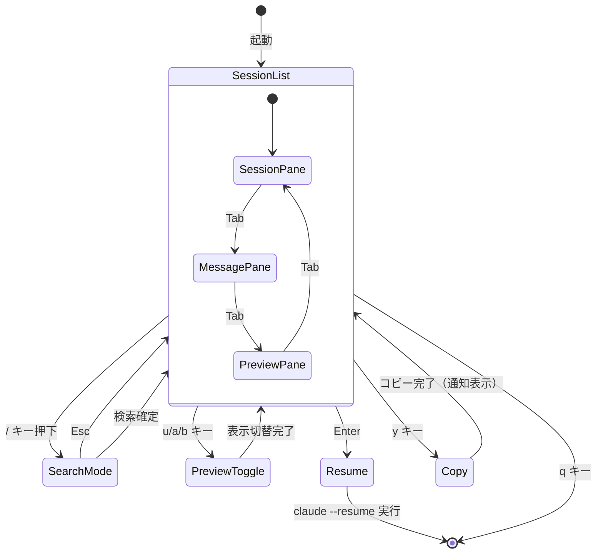
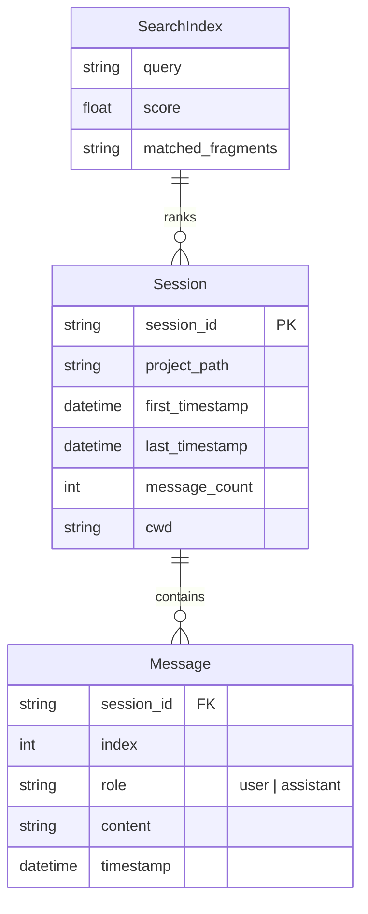
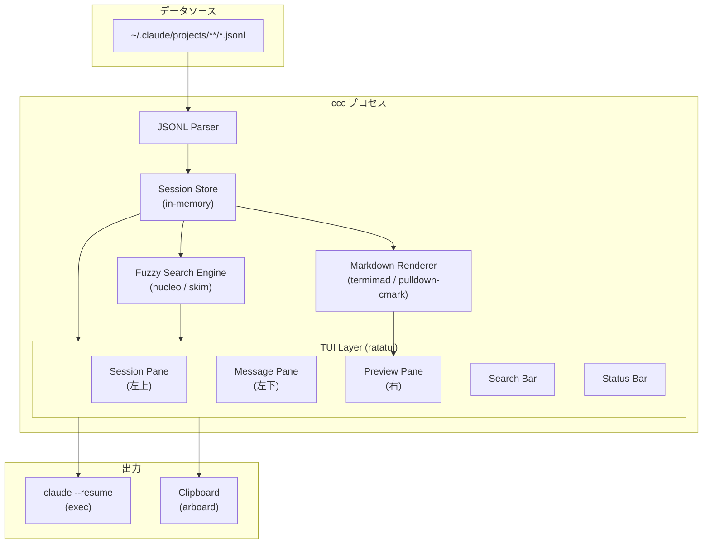
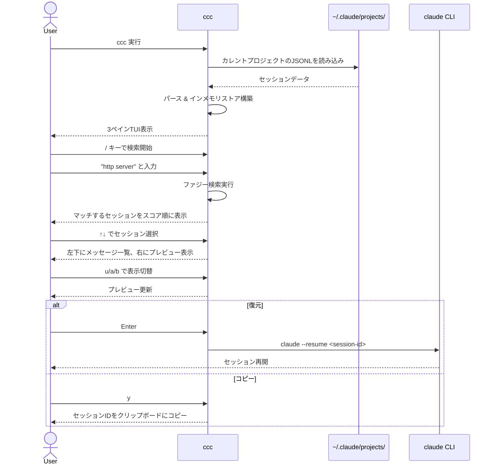
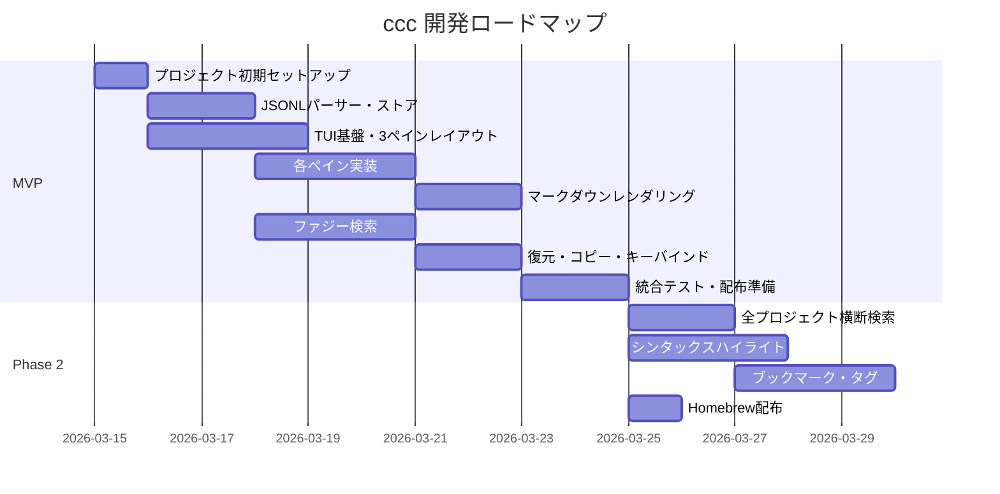

# ccc (cc collaboration) — プロダクト設計書

## 1. 概要・ビジョン

**一言**: Claude Code のチャット履歴を全文ファジー検索し、3ペインTUIでプレビュー・復元できるツール。

**なぜ作るか**: `claude --resume` はタイトルのみ検索可能で、実際の会話内容にたどり着けない。過去のセッションの「背景」「文脈」が見えず、適切なセッションを選べない。

**既存ツールとの差別化 (vs ccresume)**:

| 観点 | ccresume | ccc |
|------|----------|-----|
| 検索 | セッション一覧のフィルタ | 全メッセージ対象のファジー検索 |
| レイアウト | 2ペイン | 3ペイン（セッション概要 + メッセージ一覧 + プレビュー） |
| プレビュー | プレーンテキスト | マークダウンレンダリング |
| 技術 | React Ink (Node.js) | Rust (高速起動・低メモリ) |
| 配布 | npx | バイナリ (Homebrew / cargo install) |

## 2. ターゲットユーザー

- **ペルソナ**: Claude Code を日常的に使うソフトウェアエンジニア
- **利用状況**: 過去の会話を振り返りたいとき、以前の議論を再開したいとき
- **前提**: ターミナルベースのワークフローに馴染んでいる

## 3. コア機能

### 3.1 3ペインTUIレイアウト

```
┌─────────────────────────────┬──────────────────────────────────────┐
│  セッション一覧 (左上)        │                                      │
│  ────────────────────        │  チャットプレビュー (右)                │
│  📅 2026-03-15 14:30         │                                      │
│  📁 ~/work/my-project        │  User:                               │
│  💬 12 messages              │  > RustでHTTPサーバーを作りたい         │
│ ▶ 📅 2026-03-14 09:00       │                                      │
│  📁 ~/work/my-project        │  Assistant:                          │
│  💬 8 messages               │  `axum` を使った実装を提案します。      │
│                              │  ```rust                             │
│                              │  use axum::{Router, routing::get};   │
├──────────────────────────────┤  ...                                 │
│  メッセージ一覧 (左下)         │                                      │
│  ────────────────────        │  User:                               │
│  🔍 [検索: http ser_____]    │  > エラーハンドリングも追加して         │
│                              │                                      │
│  > Rustでhttp serverを作り…  │  Assistant:                          │
│    エラーハンドリングも追加…    │  エラーハンドリングを追加しました。    │
│    テスト書いて               │  ...                                 │
│    CORSの設定どうすれば       │                                      │
│                              │                                      │
└──────────────────────────────┴──────────────────────────────────────┘
 [↑↓] 移動  [Tab] ペイン切替  [/] 検索  [u/a/b] 表示切替  [Enter] 復元  [y] コピー  [q] 終了
```

#### 左上ペイン: セッション一覧
- セッションの日付・時刻
- プロジェクトパス（cwd）
- メッセージ数
- **チャット内容は表示しない**（ノイズ低減）

#### 左下ペイン: メッセージ一覧
- 選択中セッションの **user メッセージのみ** を1行ずつリスト表示
- 検索バーを上部に配置
- 検索ヒット時はマッチ箇所をハイライト

#### 右ペイン: チャットプレビュー
- user / assistant / both で表示切替（`u` / `a` / `b` キー）
- **マークダウンレンダリング対応**（見出し、リスト、コードブロック、インラインコード）
- スクロール可能

### 3.2 ファジー全文検索

- 検索対象: セッション内の全メッセージ（user + assistant）
- ファジーマッチ対応（タイポ許容、部分一致）
- 検索結果はスコア順にセッションをランキング
- インクリメンタル検索（入力するたびにリアルタイム絞り込み）
- 検索ヒット箇所をプレビュー内でハイライト

### 3.3 セッション復元

- **Enter**: `claude --resume <session-id>` を実行（cccを終了し、子プロセスとしてclaude起動）
- **y キー**: セッションID をクリップボードにコピー

### 3.4 検索スコープ

- カレントプロジェクト（cwd）に紐づくセッションのみ表示
- `~/.claude/projects/` 配下のプロジェクトディレクトリから該当ファイルを特定

## 4. ビジネスモデル

- **OSS（MIT License）**
- **無料**
- KPI: GitHub Stars、cargo install / Homebrew install 数

## 5. MVPスコープ

### 含めるもの

| 機能 | 説明 |
|------|------|
| 3ペインTUIレイアウト | 左上（セッション一覧）、左下（メッセージ一覧）、右（プレビュー） |
| JSONL パース | `~/.claude/projects/` のセッションファイルを読み込み・解析 |
| ファジー全文検索 | 全メッセージ対象、インクリメンタル、ファジーマッチ |
| マークダウンレンダリング | プレビューペインでの見出し・リスト・コードブロック表示 |
| 表示切替 | user / assistant / both の切替 |
| セッション復元 | Enter で claude --resume 実行 |
| クリップボードコピー | y キーでセッションIDコピー |
| キーボードナビゲーション | 矢印キー、Tab、検索モード切替 |

### 含めないもの（Phase 2 以降）

| 機能 | 理由 |
|------|------|
| 全プロジェクト横断検索 | MVPはカレントプロジェクトに集中。横断検索はPhase 2 |
| セッションのブックマーク・タグ付け | 追加データストアが必要。Phase 2 |
| セッションの削除 | 破壊的操作は慎重に。Phase 2 |
| シンタックスハイライト（コードブロック内） | マークダウンレンダリングのみでMVPは十分。Phase 2 |
| カスタムキーバインド設定 | Phase 2 |
| セッションのエクスポート | Phase 2 |
| マウス操作対応 | Phase 2 |

### 成功基準

- 起動から検索結果表示まで 500ms 以内（100セッション規模）
- ファジー検索で意図したセッションが上位5件に入る
- 自分自身が `claude --resume` の代わりに常用できる

## 6. 画面設計

### 画面遷移



### キーバインド一覧

| キー | コンテキスト | アクション |
|------|-------------|-----------|
| `↑` / `k` | セッション/メッセージペイン | 上移動 |
| `↓` / `j` | セッション/メッセージペイン | 下移動 |
| `Tab` | 全体 | アクティブペイン切替（左上→左下→右→左上） |
| `Shift+Tab` | 全体 | アクティブペイン逆切替 |
| `/` | 全体 | 検索モード開始 |
| `Esc` | 検索モード | 検索モード終了 |
| `Enter` | セッションペイン | セッション復元（claude --resume） |
| `y` | セッションペイン | セッションIDをクリップボードにコピー |
| `u` | 全体 | プレビュー: userメッセージのみ表示 |
| `a` | 全体 | プレビュー: assistantメッセージのみ表示 |
| `b` | 全体 | プレビュー: 両方表示 |
| `q` | 全体（検索モード以外） | 終了 |
| `Ctrl+u` | プレビューペイン | 半ページ上スクロール |
| `Ctrl+d` | プレビューペイン | 半ページ下スクロール |

## 7. データモデル

### データソース

Claude Code のセッション履歴ファイル（読み取り専用）:

```
~/.claude/projects/<project-path-hash>/
  <session-id>.jsonl
```

### JSONL レコード構造（入力）

```json
{
  "type": "user" | "assistant",
  "message": {
    "role": "user" | "assistant",
    "content": "..." | [{"type": "text", "text": "..."}]
  },
  "timestamp": "2026-03-15T14:30:00.000Z",
  "sessionId": "abc123",
  "cwd": "/Users/user/work/my-project"
}
```

### 内部データモデル（インメモリ）



### テーブル定義

#### Session

| フィールド | 型 | 説明 |
|-----------|------|------|
| session_id | String | セッション一意識別子（ファイル名から取得） |
| project_path | String | プロジェクトパス |
| first_timestamp | DateTime | 最初のメッセージのタイムスタンプ |
| last_timestamp | DateTime | 最後のメッセージのタイムスタンプ |
| message_count | usize | メッセージ総数 |
| cwd | String | 実行ディレクトリ |

#### Message

| フィールド | 型 | 説明 |
|-----------|------|------|
| session_id | String | 所属セッションID |
| index | usize | メッセージの順序インデックス |
| role | Role (enum) | user / assistant |
| content | String | メッセージ本文（テキスト部分を結合） |
| timestamp | DateTime | メッセージのタイムスタンプ |

## 8. システム構成



### 主要クレート（想定）

| クレート | 用途 |
|---------|------|
| `ratatui` + `crossterm` | TUIフレームワーク + ターミナルバックエンド |
| `nucleo` or `fuzzy-matcher` | ファジー検索エンジン |
| `pulldown-cmark` | マークダウンパース |
| `arboard` | クリップボード操作 |
| `serde` + `serde_json` | JSONL パース |
| `chrono` | タイムスタンプ処理 |
| `dirs` | ホームディレクトリ解決 |
| `clap` | CLI引数パース |

> **注意**: 技術選定の最終決定は `/init-project` で行う。ここでは設計の参考としてクレートを列挙している。

## 9. ユーザーフロー



## 10. 非機能要件

| 項目 | 要件 |
|------|------|
| 起動速度 | 100セッション規模で 500ms 以内 |
| メモリ使用量 | 100セッション規模で 50MB 以内 |
| 検索レスポンス | インクリメンタル、キー入力から 100ms 以内に結果更新 |
| 対応OS | macOS, Linux（Windows は Phase 2） |
| ターミナル | 256色以上対応のターミナル |
| 最小端末サイズ | 80x24 |

## 11. タスク一覧

| # | タスク | 優先度 | フェーズ | 依存 | 概要 |
|---|--------|--------|----------|------|------|
| 1 | プロジェクト初期セットアップ | 🔴 High | MVP | - | /init-project でRustプロジェクト作成、CLAUDE.md生成 |
| 2 | JSONLパーサー実装 | 🔴 High | MVP | 1 | セッションファイルの読み込み・パース・データモデル構築 |
| 3 | セッションストア実装 | 🔴 High | MVP | 2 | インメモリストア、カレントプロジェクトのフィルタリング |
| 4 | TUI基盤構築 | 🔴 High | MVP | 1 | ratatui初期化、3ペインレイアウト、イベントループ |
| 5 | セッション一覧ペイン | 🔴 High | MVP | 3, 4 | 左上ペイン: セッション一覧表示、選択UI |
| 6 | メッセージ一覧ペイン | 🔴 High | MVP | 3, 4 | 左下ペイン: userメッセージの1行リスト表示 |
| 7 | チャットプレビューペイン | 🔴 High | MVP | 3, 4 | 右ペイン: チャット内容表示、スクロール |
| 8 | マークダウンレンダリング | 🔴 High | MVP | 7 | プレビューペインでのMDレンダリング（見出し、コード、リスト） |
| 9 | 表示切替機能 | 🟡 Medium | MVP | 7 | u/a/bキーによるuser/assistant/both切替 |
| 10 | ファジー検索エンジン | 🔴 High | MVP | 3 | nucleo等によるファジーマッチ、スコアリング |
| 11 | 検索UI | 🔴 High | MVP | 4, 10 | 検索バー、インクリメンタル検索、ハイライト |
| 12 | セッション復元 | 🔴 High | MVP | 5 | Enter で claude --resume 実行 |
| 13 | クリップボードコピー | 🟡 Medium | MVP | 5 | y キーでセッションIDコピー |
| 14 | キーバインド統合 | 🟡 Medium | MVP | 4-13 | 全キーバインドの統合・テスト |
| 15 | 配布準備 | 🟡 Medium | MVP | 14 | Cargo.toml整備、README、cargo install対応 |
| 16 | 全プロジェクト横断検索 | 🟡 Medium | Phase 2 | 3 | スコープ切替機能 |
| 17 | シンタックスハイライト | 🟡 Medium | Phase 2 | 8 | コードブロック内の言語別ハイライト |
| 18 | セッションブックマーク | 🟢 Low | Phase 2 | 3 | ブックマーク用ローカルDB (SQLite等) |
| 19 | Homebrew Formula | 🟢 Low | Phase 2 | 15 | Homebrew tap作成・配布 |
| 20 | カスタムキーバインド | 🟢 Low | Phase 2 | 14 | 設定ファイルからのキーバインド読み込み |
| 21 | マウス操作対応 | 🟢 Low | Phase 2 | 4 | クリック、スクロール操作 |
| 22 | Windows対応 | 🟢 Low | Phase 2 | 4 | Windows Terminal対応・テスト |

## 12. フェーズロードマップ



## 13. 技術的な制約・注意事項

- **読み取り専用**: セッションファイルへの書き込みは一切行わない
- **マルチバイト文字**: 日本語等のワイド文字の幅計算に注意（unicode-width クレート）
- **大量セッション**: セッション数が1000を超える場合のパフォーマンスを考慮（遅延読み込み検討）
- **JSONL形式の変更**: Claude Codeのアップデートで形式が変わる可能性あり。パーサーはロバストに実装
- **claude --resume の引数仕様**: Claude CLIの仕様変更に追従する必要あり
- **ターミナルリサイズ**: ウィンドウサイズ変更時のレイアウト再計算が必要
